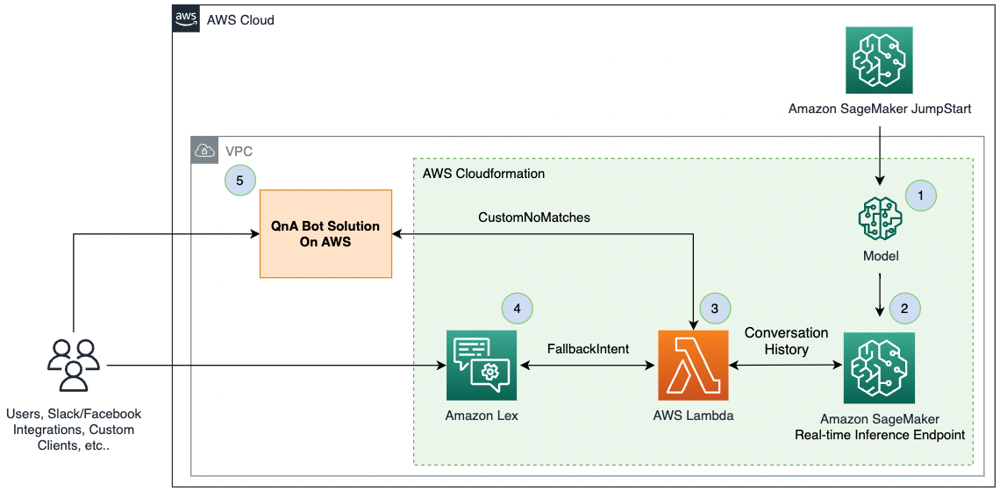

# Getting Started on Generative AI with Conversational AI and Large Language Model (LLMS)

This repository is meant as an accompaniment to the blogpost [Exploring Generative AI in conversational experiences: An Introduction with Amazon Lex, Langchain, and SageMaker Jumpstart
](https://aws.amazon.com/blogs/machine-learning/exploring-generative-ai-in-conversational-experiences-an-introduction-with-amazon-lex-langchain-and-sagemaker-jumpstart/) illustrating a sample integration with AWS Lambda, Amazon Lex, an out of the box LLM from Sagemaker Jumpstart, and [Langchain](https://python.langchain.com/en/latest/index.html)

## Architecture


## Lambda Code Overview
The `/src/bot_dispatcher` directory has the code for the AWS Lambda Function used to fulfill requests from either the QnABot or the Amazon Lex V2 Bot that will communicate with the LLM hosted in Sagemaker.

Directory structure is as follows
```
├── __init__.py
├── dispatchers
│   ├── LexV2SMLangchainDispatcher.py
│   ├── QnABotSMLangchainDispatcher.py
│   ├── __init__.py
│   └── utils.py
├── lex_langchain_hook_function.py
├── requirements.txt
└── sm_utils
    ├── __init__.py
    └── sm_langchain_sample.py
```
Comments in the code can be seen for further details.

* **LexV2SMLangchainDispatcher.py** - Used to fulfill chats from a Amazon Lex V2 Bot
* **QnABotSMLangchainDispatcher.py** - Used to fulfill chats from the QnA bot on AWS solution
* **utils.py** - helper functions to interact with the Amazon Lex V2 sessions API
* **lex_langchain_hook_function.py** - main AWS Lambda handler
* **requirements.txt** - requirements for building the AWS Lambda Layer for Langchain.
* **sm_langchain_sample.py** - Using langchain to invoke an Amazon Sagemaker endpoint

## Cloudformation Templates
* **SMJumpstartFlanT5-llm-main.yaml** - main deployment cfn
* **SMJumpstartFlanT5-SMEndpoint.template.json** - deploys an Amazon Sagemaker endpoint hosting an LLM from Sagemaker Jumpstart
* **SMJumpstartFlanT5-LambdaHook.template.json** - deploys an AWS Lambda function that can fulfill QnABot or Amazon Lex V2 bot requests
* **SMJumpstartFlanT5-LexBot.template.json** - Lex bot that will invoke the AWS Lambda function

## Deploying resources into your own Account

### Prerequisites
* AWS CLI Credentials. We would [recommend using named profiles](https://docs.aws.amazon.com/cli/latest/userguide/cli-configure-files.html#cli-configure-files-using-profiles)
* Docker Installed

### Build the Langchain Lambda Layer
* Use the following instructions to build the zip file required to use [Langchain](https://python.langchain.com/en/latest/index.html) as an AWS Lambda Layer. LangChain is a framework for developing applications powered by language models and contains abstractions for interacting with AWS Sagemaker and integrating other capabilties. See the [conceptual Langchain documentation](https://docs.langchain.com/docs/) for more information.


1. `cd` into the `src` directory and run the following to build the Docker Image.
```
docker build -t lambda-build-langchain .
```

2. Once the Image is built, run a container from it. It wil use the `/src/build_langchain_layer.sh` script to create a virtual environment, install Langchain and it's dependencies, and zip it into the required format for an AWS Lambda Layer.
```
docker run --platform linux/amd64 \
-v "$PWD"/..:/conversational-ai-llms-with-amazon-lex-and-sagemaker \
-it lambda-build-langchain
```

3. Once it is complete, you will have a new zip file named `/src/bot_disptacher/langchain_layer.zip` which can be used as an AWS Lambda Layer for Langchain.

### Deployment

The `deploy.sh` script at the root of the directory can be used to deploy these resources into your own AWS account,

1. Ensure you are authenticated with AWS CLI credentials.
2. In the `deploy.sh` script,in lines 3 and 4, change the parameters to indicate the name of your profile and the S3 bucket where you are looking to host the assets
3. Run the script with `./deploy.sh`
4. It will deploy the Static cloudformation files and the Zip files which are used for the Lambda
    - langchain_layer.zip was generated above
    - lex-flan-lambda.zip is generated in the script in line 13
5. To deploy the solution from these resources, copy the S3 URI where the `SMJumpstartFlanT5-llm-main.yaml` was deployed and use that as as the cloudformation input.
6. When deploying the AWS Cloudformation stack, be sure to change the `S3BucketName` parameter if you are deploying using the insturctions here. By default it will refer to the public assets accomanying the blogpost.

